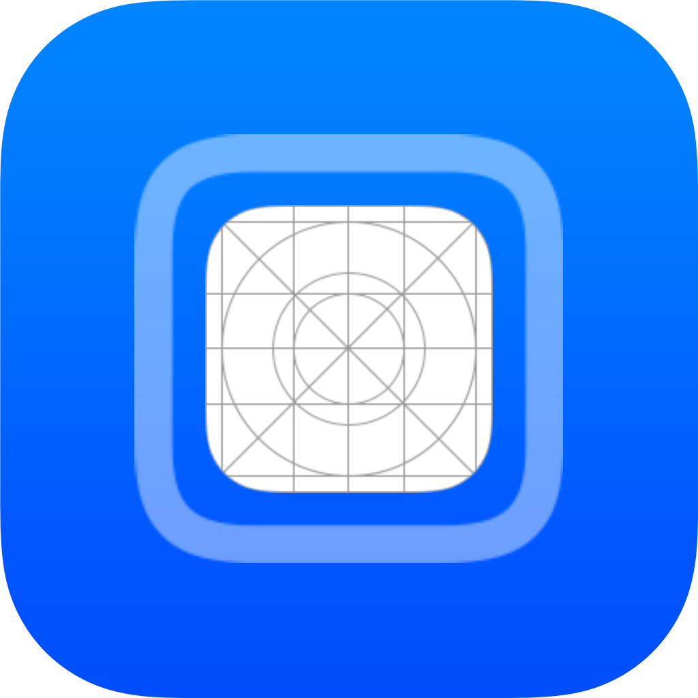

   

   

  <h1><b>LiveContainer</b></h1>
  
<i>An app launcher that runs iOS apps without actually installing them! </i>

<h6 align="center">

# LiveContainer

- LiveContainer is an app launcher (not emulator or hypervisor) that allows you to run iOS apps inside it.
- Allows you to install unlimited apps (3 app/10 app id free developer account limit does not apply here!), can have multiple versions of an app installed with multiple data containers.
- When JIT is available, codesign is entirely bypassed, no need to sign your apps before installing. Otherwise, app will be signed with the same certificate used by LiveContainer.

>[!Note]
It’s recommended to follow the following steps to set up JIT-Less mode for using LiveContainer without JIT. If you encounter any issues, please review #265 first before reporting them.

# Installation

## Requirements

- iOS/iPadOS 15+
- AltStore 2.0+ / SideStore 0.6.0+

## Download Mthods
### Stable:
  [AltSource (raw)](https://raw.githubusercontent.com/LiveContainer/LiveContainer/refs/heads/main/apps.json) ([Add to AltStore](https://tinyurl.com/LCAltStoreClassic), [Add to SideStore](https://tinyurl.com/LCSideStore)), [IPA download](https://github.com/LiveContainer/LiveContainer/releases/latest/download/LiveContainer.ipa)

### Nightly:
  [AltSource (raw)](https://github.com/LiveContainer/LiveContainer/releases/download/nightly/apps_nightly.json) ([Add to AltStore](https://tinyurl.com/LC-NAltStoreClassic), [Add to SideStore](https://tinyurl.com/LC-NSideStore)), [IPA download](https://github.com/LiveContainer/LiveContainer/releases/download/nightly/LiveContainer.ipa)

- It is recommended to setup JIT-Less mode, in which LiveContainer signs your apps with your certificate from AltStore/SideStore (see the instructions below).

## Installation

### JIT-Less mode (Without JIT \[recommended])
These steps can be bypassed if you don't mind enabling JIT for your app every time, but it is not recommended. Without JIT, guest apps need to be codesigned, which requires retrieving the certificate and password from AltStore/SideStore.

>[!Note] 
JIT-Less mode does not mean you can't enable JIT for your apps. Instead, it means JIT is not required to launch an app. If you want to use JIT, see the instructions below in "JIT Support" section. 
If something goes wrong, please check "JIT-Less Mode Diagnose" for more information.

#### Method 1 (Requires AltStore 2.2.1+ / SideStore 0.6.2-nightly+ \[recommended])
- Open Settings in LiveContainer 
- Tap "Import Certificate from AltStore/SideStore"
- AltStore/SideStore will be opened and ask if you want to export the certificate. If you don't see the prompt, keep AltStore/SideStore open in the background and tap "Import Certificate from AltStore/SideStore" again.
- Press "Export" in SideStore or set a password and export in AltStore
- Tap "JIT-Less Mode Diagnose" and tap "Test JIT-Less Mode"
- If it says "JIT-Less Mode Test Passed", you are good to go!
>[!Note] 
If you reinstall AltStore/SideStore using AltServer, you will need to go through these steps again or risk needing to reinstall the app.

### Installing Apps
- Open LiveContainer, tap the plus icon in the upper right hand corner and select IPA files to install.
- Choose the app you want to open in the next launch.
- You can long-press the app to manage it.

### Add to Home Screen
Long press the app and you will see 2 ways to add your app to home screen:
1. **Launch URL**: Copy the provided URL, create a shortcut that opens the app, and add it to your home screen. You’ll need to create a separate shortcut for each app.
2. **Create App Clip**: Install an App Clip MDM profile, which adds the app to your home screen. Note that launching the app includes an extra jump, and the App Clip will remain in the app switcher.

### Multiple LiveContainers
Using two LiveContainers allows you to run two different apps simultaneously, with *almost* seamless data transfer between the LiveContainers.

To install a second LiveContainer, go to Settings and tap "Install Another LiveContainer."

The first LiveContainer (blue icon) always launches by default.
If an app is already running in the first container, you'll be prompted to either open it in the second LiveContainer (gray icon) or terminate the current app and relaunch it in the first. If the app is already running in the second container, it will switch automatically.
To use an app in the second container, you must convert this app to a shared app. You can do that by opening the first LiveContainer (blue), long press on your app, open the settings of your app and then "Convert to Shared App". After that, you can launch your app using LiveContainer2 (grey).

### Multitasking
You can now launch multiple apps simultaneously in in-app virtual windows. These windows can be resized, scaled, and even displayed using the native Picture-in-Picture (PiP) feature. On iPads, apps can run in native window mode, displaying each app in a separate system window. And if you wish, you can choose to run apps in multitasking mode by default in settings.

To use multitasking:
1. Convert the app you want to multitask into a **shared app**.
2. Hold its banner and tap **"Multitask"**.

>[!Note]
>1. To use multitasking, ensure you select **"Keep Extension"** when installing via SideStore/AltStore.  
>2. If you want to enable JIT for multitasked apps, you’ll need a JIT enabler that supports attaching by PID.

### Fix File Picker & Local Notification
Some apps may experience issues with their file pickers or not be able to apply for notification permission in LiveContainer. To resolve this, enable "Fix File Picker & Local Notification" in the app-specific settings.

### "Open In App" Support
- Tap the link icon in the top-right corner of the "Apps" tab and input the URL. LiveContainer will detect the appropriate app and ask if you want to launch it.
- What's more, you can share a web page to LiveContainer using [this shortcut](https://www.icloud.com/shortcuts/44ea82ce7ed8469ea24198c375db09a0). Be sure to add this shortcut to "Favorites" in share sheet actions.

### JIT Support
Check out section 5.8 in [LiveContainer FAQ](https://github.com/LiveContainer/LiveContainer/issues/265)

### Installing external tweaks
LiveContainer comes with its own TweakLoader, which automatically load CydiaSubstrate and tweaks. TweakLoader is injected to every app you install. You can override `TweakLoader.dylib` symlink with your own implementation if you wish.

.dylib files in `Tweaks` folder are global, they are loaded to all apps. You can create app-specific tweaks folder and switch between them instantly.

To install tweaks, you can use the built-in tweak manager in LiveContainer, which will automatically sign tweaks as you import. Otherwise, you can manually add them and then use the tweak manager to sign them.

### Hiding Apps
LiveContainer offers three levels of app hiding:
- **Lock Apps**: In the app-specific settings, you can lock an app, requiring Face ID or a password to launch it.
- **Hide Locked Apps**: Once locked, you can hide the app. It will appear as a placeholder in the "Hidden Apps" section, and authentication is needed to view or launch it.
- **Strict Hiding Mode**: For complete invisibility, enable "Strict Hiding Mode" in LiveContainer's settings after authentication. Hidden apps will no longer appear in the interface. To access them, triple-tap the "x Apps in total" text on the main screen and authenticate to unlock the apps when you relaunch LiveContainer.

## Compatibility
Unfortunately, not all apps work in LiveContainer, so we have a [compatibility list](https://github.com/LiveContainer/LiveContainer/labels/compatibility) to tell if there is apps that have issues. If they aren't on this list, then it's likely going run. However, if it doesn't work, please make an [issue](https://github.com/LiveContainer/LiveContainer/issues/new/choose) about it.

## Building
Open Xcode, edit `DEVELOPMENT_TEAM[config=Debug]` in `xcconfigs/Global.xcconfig` to your team id and compile.

## Project structure
### Main executable
- Core of LiveContainer
- Contains the logic of setting up guest environment and loading guest app.
- If no app is selected, it loads LiveContainerSwiftUI.

### LiveContainerSwiftUI
- SwiftUI rewrite of LiveContainerUI (by @hugeBlack)
- Lanaguage file `Localizable.xcstrings` is in here for multilingual support. To help us translate LiveContainer, please visit [our crodwin project](https://crowdin.com/project/livecontainer)

### TweakLoader
- A simple tweak injector, which loads CydiaSubstrate and load tweaks.
- Injected to every app you install in LiveContainer.

### ZSign
- The app signer shipped with LiveContainer.
- Originally made by [zhlynn](https://github.com/zhlynn/zsign).
- LiveContainer uses [Feather's](https://github.com/khcrysalis/Feather) version of ZSign modified by khcrysalis.
- Changes are made to meet LiveContainer's need.

## How does it work?

### Patching guest executable
- Patch `__PAGEZERO` segment:
  + Change `vmaddr` to `0xFFFFC000` (`0x100000000 - 0x4000`)
  + Change `vmsize` to `0x4000`
- Change `MH_EXECUTE` to `MH_DYLIB`.
- Inject a load command to load `TweakLoader.dylib`

### Patching `@executable_path`
- Hook `dyld4::APIs::_NSGetExecutablePath`
- Call `_NSGetExecutablePath`
- Replace `config.process.mainExecutablePath`
  - Calculate address of `config.process.mainExecutablePath` using `dyld4::APIs` instance (passed as first parameter)
  - Use `builtin_vm_protect` or TPRO unlock to make it writable
  - Replace the address with one we have control of
- Put the original `dyld4::APIs::_NSGetExecutablePath` back

> Old Method
>- Call `_NSGetExecutablePath` with an invalid buffer pointer input -> SIGSEGV
>- Do some [magic stuff](https://github.com/khanhduytran0/LiveContainer/blob/5ef1e6a/main.m#L74-L115) to overwrite the contents of executable_path.

### Patching `NSBundle.mainBundle`
- This property is overwritten with the guest app's bundle.

### Bypassing Library Validation
- JIT is optional to bypass codesigning. In JIT-less mode, all executables are signed so this does not apply.
- Derived from [Restoring Dyld Memory Loading](https://blog.xpnsec.com/restoring-dyld-memory-loading)

### dlopening the executable
- Call `dlopen` with the guest app's executable
- TweakLoader loads all tweaks in the selected folder
- Find the entry point
- Jump to the entry point
- The guest app's entry point calls `UIApplicationMain` and start up like any other iOS apps.

### Multi-Account support & Keychain Semi-Separation
[128 keychain access groups](./entitlements.xml) are created and LiveContainer allocates them randomly to each container of the same app. So you can create 128 container with different keychain access groups.

## Limitations
- Entitlements from the guest app are not applied to the host app. This isn't a big deal since sideloaded apps requires only basic entitlements.
- App Permissions are globally applied.
- Guest app containers are not sandboxed. This means one guest app can access other guest apps' data.
- App extensions aren't supported. they cannot be registered because: LiveContainer is sandboxed, SpringBoard doesn't know what apps are installed in LiveContainer, and they take up App ID.
- Multitasking can be achieved by using multiple LiveContainer and the multitasking feature. However, physical keyboard may not work for apps in multitasking mode.
- Remote push notification might not work. ~~If you have a paid developer account then you don't even have to use LiveContainer~~
- Querying custom URL schemes might not work(?)

## TODO
- Use ChOma instead of custom MachO parser

## License
[Apache License 2.0](https://github.com/khanhduytran0/LiveContainer/blob/main/LICENSE)

## Credits
- [xpn's blogpost: Restoring Dyld Memory Loading](https://blog.xpnsec.com/restoring-dyld-memory-loading)
- [LinusHenze's CFastFind](https://github.com/pinauten/PatchfinderUtils/blob/master/Sources/CFastFind/CFastFind.c): [MIT license](https://github.com/pinauten/PatchfinderUtils/blob/master/LICENSE)
- [fishhook](https://github.com/facebook/fishhook): [BSD 3-Clause license](https://github.com/facebook/fishhook/blob/main/LICENSE)
- [MBRoundProgressView](https://gist.github.com/saturngod/1224648)
- @haxi0 for icon
- @Vishram1123 for the initial shortcut implementation.
- @hugeBlack for SwiftUI contribution
- @Staubgeborener for automatic AltStore/SideStore source updater
- @fkunn1326 for improved app hiding
- @slds1 for dynamic color feature
